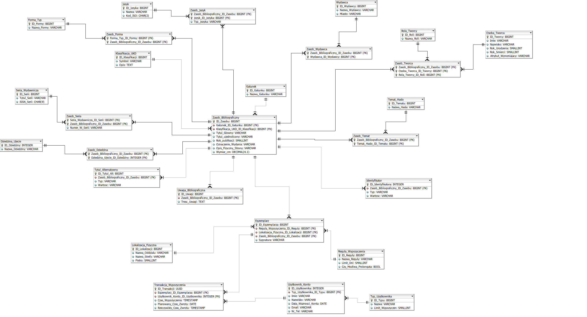

# Academic Library Management System / System Biblioteczny

An advanced relational database system designed to catalog publications and manage university library loans. Inspired by professional bibliographical standards like **FRBR** and **MARC21**.

---

## 🌐 Language Selection / Wybór języka

* [English Version (Documentation in English)](#english-version)
* [Wersja Polska (Dokumentacja po polsku)](#wersja-polska)

---

# English Version

## 1. Project Overview & Target Audience
The system is tailored for academic institutions (such as a university main library). It streamlines the daily workflow of librarians and organizes loans for students and academic staff.

### Key Features:
* **Comprehensive Cataloging:** Handles books with multiple authors, editors, or translators.
* **Physical Location Tracking:** Tracks exact items down to specific reading rooms, floors, or shelves.
* **Loan & Return Management:** Complete history log mapped to unique user accounts.
* **Flexible Library Policies:** Enforces dynamic loan periods (e.g., longer terms for professors, shorter for students).

### Sample Questions the Database Can Answer (SQL):
1. Find all physically available (not currently loaned) copies of the textbook *"Discrete Mathematics"*.
2. List all students who are overdue with their returns, including their emails and phone numbers.
3. Find all publications where *John Doe* is listed as a co-author or a translator.

## 2. Database Structure (Tables Summary)
The system consists of **26 entities** handling various data types (text, numeric, dates, timestamps, and booleans). 

1. **Zasob_Bibliograficzny:** Main metadata of a publication (title, year, pages).
2. **Osoba_Tworca:** Dictionary of all authors, editors, and translators.
3. **Zasob_Tworca:** Junction table handling many-to-many relationships between creators and books.
4. **Egzemplarz:** Represents a physical copy with a unique barcode/inventory number.
5. **Lokalizacja_Fizyczna:** Physical placement of a copy (branch, reading room, floor).
6. **Regula_Wypozyczenia:** Dictionary defining loan limits and extension rules per item type.
7. **Uzytkownik_Konto:** Student and faculty member accounts (limits, expiration dates).
8. **Transakcja_Wypozyczenia:** Historic log of every book checkout and return.
9. **Klasyfikacja_UKD:** Universal Decimal Classification mapping books to fields of study.
10. **Identyfikator:** Separate table for tracking multiple identifier codes (e.g., ISBN variants).
11. **Wydawca:** Publisher details dictionary.
12. **Zasob_Wydawca:** Junction table for multi-publisher editions.
13. **Jezyk:** Language codes dictionary.
14. **Zasob_Jezyk:** Maps languages to books (supports bilingual editions and translations).
15. **Tytul_Alternatywny:** Stores original or alternative titles.
16. **Uwaga_Bibliograficzna:** Internal librarian notes (e.g., info about an attached CD).
17. **Gatunek:** Literary genres dictionary.
18. **Forma_Typ:** Physical format of the asset (printed book, e-book).
19. **Zasob_Forma:** Maps books to their physical formats.
20. **Seria_Wydawnicza:** Publisher book series dictionary.
21. **Zasob_Seria:** Links books to a series and defines the volume number.
22. **Dziedzina_Ujecie:** Broad fields of knowledge dictionary.
23. **Zasob_Dziedzina:** Maps books to fields of knowledge.
24. **Temat_Haslo:** Detailed keywords to enhance search.
25. **Zasob_Temat:** Links books to multiple keywords.
26. **Rola_Tworcy:** Roles definition (author, editor, illustrator).

## 3. Entity Relationship Diagram (ERD)

---

# Wersja Polska

## 1. Tematyka bazy danych

Projekt dotyczy systemu bazodanowego do zarządzania katalogiem książek oraz obsługi procesu wypożyczeń. Projektując strukturę tabel, czytałem o profesjonalnych standarach bibliotecznych takich jak FRBR czy MARC21 i czerpałem z nich inspirację.

Zapożyczyłem z nich przede wszystkim pomysł na oddzielenie abstrakcyjnego opisu książki (np. tytułu i autora) od jej fizycznego egzemplarza, który leży na półce.

Ponieważ jednak są to bardzo skomplikowane systemy, moja baza wykorzystuje tylko wybrane, najważniejsze koncepcje i nie gwarantuje pełnej, technicznej zgodności z tymi standardami.

## 2. Odbiorca bazy danych i funkcjonalności

Odbiorca docelowy:

Baza została zaprojektowana ściśle na potrzeby placówki akademickiej, takiej jak biblioteka główna UG. System ma ułatwić pracę bibliotekarzom oraz uporządkować wypożyczenia realizowane przez studentów i pracowników naukowych.

Główne funkcjonalności:

* Przejrzyste katalogowanie książek (system radzi sobie z książkami, które mają wielu autorów, tłumaczy lub redaktorów).
* Śledzenie lokalizacji (dokładna informacja, w której czytelni lub na jakim piętrze znajduje się dany egzemplarz).
* Ewidencja wypożyczeń i zwrotów, przypisanych do konkretnych kont czytelników.
* Pilnowanie regulaminu biblioteki (różne czasy wypożyczeń, np. dłuższe dla wykładowców, krótsze dla studentów).

Przykładowe zapytania, które można zadać bazie (SQL):

1. Pokaż wszystkie fizycznie dostępne (czyli aktualnie niewypożyczone) egzemplarze podręcznika "Matematyka Dyskretna".
2. Wyświetl listę studentów, którzy spóźniają się ze zwrotem książek, wraz z ich adresami e-mail i numerami telefonów.
3. Znajdź wszystkie publikacje w bazie, w których Jan Kowalski jest współautorem lub tłumaczem.

## 3. Opis tabel

System składa się z 26 encji i wykorzystuje różne typy danych (np. tekst, liczby, daty, znaczniki czasu, wartości logiczne Prawda/Fałsz). Poniżej znajduje się szczegółowy opis każdej z nich, z podziałem na role, jakie pełnią w systemie:

1. **Zasob_Bibliograficzny:** Ogólne informacje o książce, takie jak główny tytuł, rok publikacji czy liczba stron.
2. **Osoba_Tworca:** Słownik wszystkich autorów, redaktorów i tłumaczy.
3. **Zasob_Tworca:** Tabela łącząca (pośrednia). Pozwala przypisać wielu twórców do jednej książki, określając, jaką rolę w niej pełnili.
4. **Egzemplarz:** Reprezentuje konkretną, fizyczną książkę z naklejonym kodem kreskowym (sygnaturą).
5. **Lokalizacja_Fizyczna:** Informacja ułatwiająca znalezienie książki (np. nazwa oddziału, czytelnia, numer piętra).
6. **Regula_Wypozyczenia:** Słownik zasad określający, na ile dni można zabrać daną książkę i czy można przedłużyć ten termin.
7. **Uzytkownik_Konto:** Dane studentów i pracowników (imię, nazwisko, data ważności konta, limit książek do wypożyczenia).
8. **Transakcja_Wypozyczenia:** Rejestr historii. Zapisuje, kto wypożyczył konkretny egzemplarz, kiedy to zrobił oraz kiedy oddał książkę.
9. **Klasyfikacja_UKD:** Przechowuje tzw. numer działu, który określa dziedzinę wiedzy i tematykę, do jakiej przypisana jest dana książka.
10. **Identyfikator:** Przechowuje różne kody przypisane do książki (np. numery ISBN). Zostały one wydzielone do osobnej tabeli, ponieważ jedna publikacja może posiadać równocześnie kilka różnych oznaczeń.
11. **Wydawca:** Słownik wydawnictw (nazwa i miasto). Zapobiega wielokrotnemu wpisywaniu tych samych danych przy wprowadzaniu do systemu nowych książek z tej samej oficyny.
12. **Zasob_Wydawca:** Tabela łącząca książkę z wydawcą. Pozwala zapisać sytuację, w której jedna publikacja została wydana wspólnie przez dwa (lub więcej) wydawnictwa.
13. **Jezyk:** Słownik języków z ich uniwersalnymi kodami (np. polski, angielski).
14. **Zasob_Jezyk:** Tabela określająca język danej książki. Pozwala m.in. zaznaczyć, że publikacja jest tekstem dwujęzycznym, lub zapisać niezależnie język oryginału i język tłumaczenia.
15. **Tytul_Alternatywny:** Miejsce na dodatkowe tytuły książki, na przykład tytuł oryginału, pod którym książka zadebiutowała w innym kraju.
16. **Uwaga_Bibliograficzna:** Dodatkowe notatki dla bibliotekarzy, np. informacje o dołączonej płycie CD czy dedykacji wpisanej na konkretnej stronie.
17. **Gatunek:** Słownik ogólnych rodzajów publikacji (np. podręcznik, monografia naukowa, powieść).
18. **Forma_Typ:** Słownik opisujący fizyczną formę nośnika (np. książka drukowana, czasopismo, e-book).
19. **Zasob_Forma:** Tabela przypisująca książkę do konkretnej formy (lub kilku form jednocześnie).
20. **Seria_Wydawnicza:** Słownik serii wydawniczych (np. "Studia i Monografie"), w ramach których regularnie ukazują się nowe tytuły.
21. **Zasob_Seria:** Tabela łącząca książkę z serią wydawniczą. Pozwala też zapisać, którym z kolei tomem w danej serii jest wprowadzana książka.
22. **Dziedzina_Ujecie:** Słownik szerokich dziedzin wiedzy (np. informatyka, matematyka, historia).
23. **Zasob_Dziedzina:** Tabela przypisująca książkę do jednej lub wielu ogólnych dziedzin wiedzy.
24. **Temat_Haslo:** Słownik szczegółowych haseł i słów kluczowych (np. "Algebra Boole'a"), które bardzo ułatwiają studentom wyszukiwanie potrzebnych materiałów.
25. **Zasob_Temat:** Tabela łącząca książkę z konkretnymi hasełami. Jest niezbędna, ponieważ akademickie podręczniki zazwyczaj poruszają jednocześnie kilka różnych tematów.
26. **Rola_Tworcy:** Słownik funkcji, jakie dana osoba pełniła przy pracy nad książką (np. autor, redaktor, ilustrator). Współpracuje bezpośrednio z tabelą **Zasob_Tworca**.

## 4. Objaśnienia abstrakcyjnych atrybutów

**Atrybut: Opis_Fizyczny_Strony**

**Definicja:** Pole przechowujące ustrukturyzowany zapis objętości publikacji oraz informacje o zawartości graficznej (z pominięciem wymiarów które przechowuje **Wymiar_cm**).

**Przykłady wartości wprowadzanych do systemu:**
1. *X, 433 s. : il.*
2. *899, s. : rys.*

## 5. Wyjaśnienie połączeń i założenia

* **Książka a Twórcy:** Zakładamy, że jedna książka może mieć wielu autorów, a jeden autor mógł napisać wiele różnych książek. Aby nie wpisywać danych tego samego człowieka wielokrotnie, zastosowałem tabelę łączącą **Zasob_Tworca**. Dzięki temu ten sam wykładowca może być autorem jednej książki i redaktorem innej.
* **Książka a Fizyczny Egzemplarz:** Biblioteka uniwersytecka często kupuje np. 20 takich samych podręczników. Zamiast wpisywać do bazy 20 razy tego samego tytułu i roku wydania, tworzymy jeden ogólny wpis w tabeli **Zasob_Bibliograficzny**, a do niego podpinamy 20 różnych rekordów w tabeli **Egzemplarz** (każdy ma swój unikalny numer inwentarzowy i stan zniszczenia).
* **Wypożyczenia:** Zakładamy, że jeden wpis w tabeli transakcji zawsze łączy jednego czytelnika z jedną konkretną książką. Jeżeli student wypożycza z biblioteki 3 książki naraz, system wygeneruje 3 oddzielne rekordy. Dzięki temu student może oddać każdą z tych książek w innym, niezależnym terminie.
* **Książka a Identyfikatory:** Współczesne publikacje rzadko mają tylko jeden kod ISBN. Mogą one mieć też np. uniwersalne numery systemowe. Wydzielenie identyfikatorów do osobnej tabeli pozwala przypisać dowolną liczbę różnych kodów do jednej książki.
* **Książka a Wydawcy:** Zdarza się, że skomplikowana monografia naukowa jest wydawana wspólnie przez dwa niezależne wydawnictwa. Tabela łącząca **Zasob_Wydawca** rozwiązuje ten problem, pozwalając przypisać wielu wydawców do jednego tytułu.
* **Książka a Słowa Kluczowe (Tematy i Dziedziny):** Akademicki podręcznik często obejmuje kilka dziedzin (np. informatykę i matematykę) oraz wiele szczegółowych zagadnień (np. "Algorytmy", "Logika"). Dzięki tabelam łączącym, bibliotekarz może przypiąć do jednej książki nieograniczoną liczbę tagów.
* **Książka a Języki:** Skrypty uczelniane to nierzadko publikacje dwujęzyczne, a zagraniczne podręczniki mają języki oryginału i tłumaczenia. Osobna tabela pozwala precyzyjnie przypisać wiele języków do jednego dzieła.
* **Książka a Serie Wydawnicze:** Na uczelniach materiały często wydawane są w cyklach (np. "Zeszyty Naukowe Wydziału Prawa"). System pozwala połączyć książkę z konkretną serią i określić, którym z kolei jest ona tomem lub zeszytem.
* **Fizyczny Egzemplarz a Lokalizacja:** Zakładamy, że każdy namacalny, fizyczny egzemplarz książki z naklejonym kodem kreskowym znajduje się w jednym, ściśle określonym miejscu (np. "Czytelnia Czasopism, piętro 2"). Dzięki temu student w katalogu od razu widzi, gdzie musi się udać.
* **Fizyczny Egzemplarz a Reguły Wypożyczeń:** Zakładamy, że zasady wypożyczeń (np. na miesiąc, na 3 dni, albo tylko do czytania na miejscu) nie są przypisane do ogólnego tytułu książki, lecz do konkretnego fizycznego egzemplarza. Dzięki temu biblioteka może z 10 posiadanych podręczników udostępnić 8 do wypożyczenia do domu, a 2 zachować w dostępie swobodnym.[^1]

[^1]: W Bibliotece UG studenci i wykładowcy mają ten sam limit wypożyczeń, ale jeżeli w pewnym momencie to się zmieni, to dzięki utworzeniu osobnej encji Typ_Uzytkownika, taka aktualizacja nie wymagałaby aktualizacji tysięcy rekordów.
